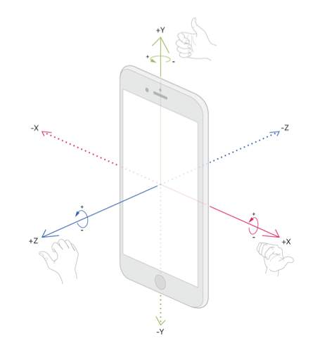

# iPhone

For more information, take a look at [developer.apple.com](https://developer.apple.com/documentation/coremotion/getting-processed-device-motion-data?language=objc).

<figure align="center">
    
    <figcaption>Figure 1. Orientation of device motion data.</figcaption>
</figure>

Figure 1. shows the orientation of the device motion data (source: [https://developer.apple.com/documentation/coremotion/getting-processed-device-motion-data?language=objc](https://developer.apple.com/documentation/coremotion/getting-processed-device-motion-data?language=objc)).
